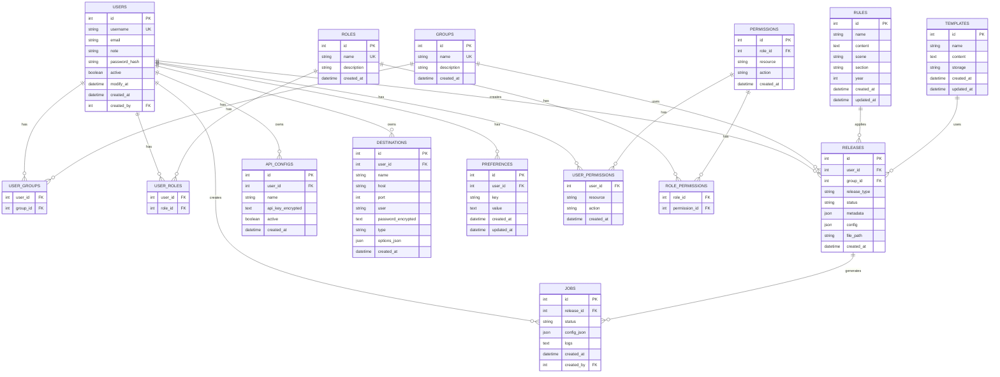

# 📊 Diagramme ERD - Base de Données MySQL

**Date** : 2025-11-01  
**Version** : 1.0.0  
**Statut** : Draft  
**SGBD** : MySQL 8.0+ (InnoDB)

---

## 🎯 Vue d'Ensemble

Base de données MySQL pour eBook Scene Packer v2 avec modèles utilisateurs, rôles, permissions, releases, jobs, rules, configurations et préférences.

**Moteur** : InnoDB (obligatoire)

**Encodage** : UTF-8 (utf8mb4)

---

## 📊 Diagramme ERD (Mermaid)

**Note** : Si Mermaid n'est pas supporté, voir spécifications détaillées ci-dessous.



---

## 📋 Spécifications Détaillées des Tables

### Table `users`

**Description** : Utilisateurs de l'application

| Colonne | Type | Contraintes | Description |
|---------|------|-------------|-------------|
| `id` | INT | PRIMARY KEY, AUTO_INCREMENT | Identifiant unique |
| `username` | VARCHAR(100) | UNIQUE, NOT NULL, INDEX | Nom d'utilisateur (unique) |
| `email` | VARCHAR(255) | NULL | Adresse email |
| `note` | TEXT | NULL | Note/commentaire utilisateur |
| `password_hash` | VARCHAR(255) | NOT NULL | Hash mot de passe (werkzeug PBKDF2) |
| `active` | BOOLEAN | NOT NULL, DEFAULT TRUE | Statut actif/inactif |
| `modify_at` | DATETIME | NULL | Date dernière modification |
| `created_at` | DATETIME | NOT NULL, DEFAULT CURRENT_TIMESTAMP | Date création |
| `created_by` | INT | NULL, FOREIGN KEY (users.id) | Utilisateur créateur (audit) |

**Index** :
- PRIMARY KEY (`id`)
- UNIQUE (`username`)
- INDEX (`active`)
- INDEX (`created_at`)

**Relations** :
- `created_by` → `users.id` (self-reference pour audit)

---

### Table `roles`

**Description** : Rôles disponibles dans l'application

| Colonne | Type | Contraintes | Description |
|---------|------|-------------|-------------|
| `id` | INT | PRIMARY KEY, AUTO_INCREMENT | Identifiant unique |
| `name` | VARCHAR(100) | UNIQUE, NOT NULL | Nom du rôle |
| `description` | TEXT | NULL | Description du rôle |
| `created_at` | DATETIME | NOT NULL, DEFAULT CURRENT_TIMESTAMP | Date création |

**Index** :
- PRIMARY KEY (`id`)
- UNIQUE (`name`)

**Relations** :
- Aucune (table indépendante)

---

### Table `permissions`

**Description** : Permissions disponibles (baseline pour rôles)

| Colonne | Type | Contraintes | Description |
|---------|------|-------------|-------------|
| `id` | INT | PRIMARY KEY, AUTO_INCREMENT | Identifiant unique |
| `role_id` | INT | NULL, FOREIGN KEY (roles.id) | Rôle associé (si permission de rôle) |
| `resource` | VARCHAR(50) | NOT NULL | Ressource (releases, rules, users, roles, config) |
| `action` | VARCHAR(20) | NOT NULL | Action (READ, WRITE, MOD, DELETE) |
| `created_at` | DATETIME | NOT NULL, DEFAULT CURRENT_TIMESTAMP | Date création |

**Index** :
- PRIMARY KEY (`id`)
- INDEX (`role_id`)
- INDEX (`resource`, `action`)
- UNIQUE (`role_id`, `resource`, `action`) si role_id NOT NULL

**Relations** :
- `role_id` → `roles.id` (si permission associée à rôle)

**Note** : Cette table peut contenir permissions globales (role_id NULL) ou permissions spécifiques à un rôle (role_id NOT NULL).

---

### Table `groups`

**Description** : Groupes Scene disponibles

| Colonne | Type | Contraintes | Description |
|---------|------|-------------|-------------|
| `id` | INT | PRIMARY KEY, AUTO_INCREMENT | Identifiant unique |
| `name` | VARCHAR(100) | UNIQUE, NOT NULL | Nom du groupe Scene |
| `description` | TEXT | NULL | Description du groupe |
| `created_at` | DATETIME | NOT NULL, DEFAULT CURRENT_TIMESTAMP | Date création |

**Index** :
- PRIMARY KEY (`id`)
- UNIQUE (`name`)

**Relations** :
- Aucune (table indépendante)

---

### Table `user_groups`

**Description** : Relation many-to-many entre utilisateurs et groupes

| Colonne | Type | Contraintes | Description |
|---------|------|-------------|-------------|
| `user_id` | INT | NOT NULL, FOREIGN KEY (users.id) | ID utilisateur |
| `group_id` | INT | NOT NULL, FOREIGN KEY (groups.id) | ID groupe |

**Index** :
- PRIMARY KEY (`user_id`, `group_id`)
- INDEX (`user_id`)
- INDEX (`group_id`)

**Relations** :
- `user_id` → `users.id` ON DELETE CASCADE
- `group_id` → `groups.id` ON DELETE CASCADE

---

### Table `user_roles`

**Description** : Relation many-to-many entre utilisateurs et rôles

| Colonne | Type | Contraintes | Description |
|---------|------|-------------|-------------|
| `user_id` | INT | NOT NULL, FOREIGN KEY (users.id) | ID utilisateur |
| `role_id` | INT | NOT NULL, FOREIGN KEY (roles.id) | ID rôle |

**Index** :
- PRIMARY KEY (`user_id`, `role_id`)
- INDEX (`user_id`)
- INDEX (`role_id`)

**Relations** :
- `user_id` → `users.id` ON DELETE CASCADE
- `role_id` → `roles.id` ON DELETE CASCADE

**Note** : Normalement un utilisateur a un seul rôle, mais relation many-to-many pour flexibilité.

---

### Table `role_permissions`

**Description** : Relation many-to-many entre rôles et permissions

| Colonne | Type | Contraintes | Description |
|---------|------|-------------|-------------|
| `role_id` | INT | NOT NULL, FOREIGN KEY (roles.id) | ID rôle |
| `permission_id` | INT | NOT NULL, FOREIGN KEY (permissions.id) | ID permission |

**Index** :
- PRIMARY KEY (`role_id`, `permission_id`)
- INDEX (`role_id`)
- INDEX (`permission_id`)

**Relations** :
- `role_id` → `roles.id` ON DELETE CASCADE
- `permission_id` → `permissions.id` ON DELETE CASCADE

---

### Table `user_permissions`

**Description** : Permissions personnalisées pour utilisateurs (override permissions rôle)

| Colonne | Type | Contraintes | Description |
|---------|------|-------------|-------------|
| `id` | INT | PRIMARY KEY, AUTO_INCREMENT | Identifiant unique |
| `user_id` | INT | NOT NULL, FOREIGN KEY (users.id) | ID utilisateur |
| `resource` | VARCHAR(50) | NOT NULL | Ressource (releases, rules, users, roles, config) |
| `action` | VARCHAR(20) | NOT NULL | Action (READ, WRITE, MOD, DELETE) |
| `created_at` | DATETIME | NOT NULL, DEFAULT CURRENT_TIMESTAMP | Date création |

**Index** :
- PRIMARY KEY (`id`)
- INDEX (`user_id`)
- INDEX (`resource`, `action`)
- UNIQUE (`user_id`, `resource`, `action`)

**Relations** :
- `user_id` → `users.id` ON DELETE CASCADE

**Note** : Permissions personnalisées qui override les permissions du rôle.

---

### Table `releases`

**Description** : Releases créées par les utilisateurs

| Colonne | Type | Contraintes | Description |
|---------|------|-------------|-------------|
| `id` | INT | PRIMARY KEY, AUTO_INCREMENT | Identifiant unique |
| `user_id` | INT | NOT NULL, FOREIGN KEY (users.id) | ID utilisateur créateur |
| `group_id` | INT | NOT NULL, FOREIGN KEY (groups.id) | ID groupe Scene |
| `release_type` | VARCHAR(20) | NOT NULL | Type (EBOOK, TV, DOCS, AUDIOBOOK, GAME) |
| `status` | VARCHAR(20) | NOT NULL, DEFAULT 'draft' | Statut (draft, completed, failed) |
| `metadata` | JSON | NULL | Métadonnées complètes (JSON) |
| `config` | JSON | NULL | Configuration packaging (JSON) |
| `file_path` | VARCHAR(500) | NULL | Chemin fichier source |
| `created_at` | DATETIME | NOT NULL, DEFAULT CURRENT_TIMESTAMP | Date création |

**Index** :
- PRIMARY KEY (`id`)
- INDEX (`user_id`)
- INDEX (`group_id`)
- INDEX (`release_type`)
- INDEX (`status`)
- INDEX (`created_at`)

**Relations** :
- `user_id` → `users.id`
- `group_id` → `groups.id`

---

### Table `jobs`

**Description** : Jobs de packaging et actions sur releases

| Colonne | Type | Contraintes | Description |
|---------|------|-------------|-------------|
| `id` | INT | PRIMARY KEY, AUTO_INCREMENT | Identifiant unique |
| `release_id` | INT | NULL, FOREIGN KEY (releases.id) | ID release associée (si packaging) |
| `status` | VARCHAR(20) | NOT NULL, DEFAULT 'pending' | Statut (pending, running, completed, failed) |
| `config_json` | JSON | NULL | Configuration job (JSON) |
| `logs` | TEXT | NULL | Logs du job |
| `created_at` | DATETIME | NOT NULL, DEFAULT CURRENT_TIMESTAMP | Date création |
| `created_by` | INT | NOT NULL, FOREIGN KEY (users.id) | ID utilisateur créateur |

**Index** :
- PRIMARY KEY (`id`)
- INDEX (`release_id`)
- INDEX (`status`)
- INDEX (`created_by`)
- INDEX (`created_at`)

**Relations** :
- `release_id` → `releases.id` ON DELETE SET NULL
- `created_by` → `users.id`

**Note** : Un job peut être indépendant d'une release (ex: action spéciale).

---

### Table `rules`

**Description** : Rules Scene locales (téléchargées depuis scenerules.org ou uploadées)

**⚠️ CRITIQUE** : Pour EBOOK, la règle [2022] eBOOK DOIT être analysée intégralement pour extraction des spécifications.

| Colonne | Type | Contraintes | Description |
|---------|------|-------------|-------------|
| `id` | INT | PRIMARY KEY, AUTO_INCREMENT | Identifiant unique |
| `name` | VARCHAR(255) | NOT NULL | Nom de la rule |
| `content` | TEXT | NOT NULL | Contenu rule (NFO) - ⚠️ DOIT contenir règle complète |
| `scene` | VARCHAR(50) | NULL | Scène (English, French, German, etc.) |
| `section` | VARCHAR(50) | NULL | Section (eBOOK, TV-720p, X264, etc.) |
| `year` | INT | NULL | Année de la rule (2022 pour eBOOK actuel) |
| `source` | VARCHAR(50) | NULL, DEFAULT 'local' | Source (local, scenerules.org) |
| `source_url` | VARCHAR(500) | NULL | URL source si téléchargée (scenerules.org) |
| `created_at` | DATETIME | NOT NULL, DEFAULT CURRENT_TIMESTAMP | Date création |
| `updated_at` | DATETIME | NULL, ON UPDATE CURRENT_TIMESTAMP | Date dernière modification |

**Index** :
- PRIMARY KEY (`id`)
- INDEX (`scene`)
- INDEX (`section`)
- INDEX (`year`)
- INDEX (`scene`, `section`, `year`)
- FULLTEXT (`name`, `content`) pour recherche

**Relations** :
- `rules.id` → `rule_specs.rule_id` (one-to-many)

---

### Table `rule_specs`

**Description** : Spécifications extraites des règles parsées (⚠️ CRITIQUE pour EBOOK - permet validation conforme)

**⚠️ CRITIQUE** : Cette table stocke les spécifications parsées de la règle [2022] eBOOK pour validation et packaging conforme.

| Colonne | Type | Contraintes | Description |
|---------|------|-------------|-------------|
| `id` | INT | PRIMARY KEY, AUTO_INCREMENT | Identifiant unique |
| `rule_id` | INT | NOT NULL, FOREIGN KEY (rules.id) | ID règle associée |
| `rule_type` | VARCHAR(50) | NOT NULL | Type (EBOOK, TV, DOCS, etc.) |
| `rule_year` | INT | NOT NULL | Année règle (2022 pour eBOOK) |
| `spec_json` | JSON | NOT NULL | Spécifications parsées structurées (formats, nommage, contraintes) |
| `parsed_at` | DATETIME | NOT NULL, DEFAULT CURRENT_TIMESTAMP | Date parsing |
| `parser_version` | VARCHAR(20) | NOT NULL | Version parser utilisée |

**Index** :
- PRIMARY KEY (`id`)
- INDEX (`rule_id`)
- INDEX (`rule_type`, `rule_year`)
- UNIQUE (`rule_id`, `rule_type`, `rule_year`)

**Relations** :
- `rule_id` → `rules.id` ON DELETE CASCADE

**Format `spec_json`** (exemple pour EBOOK) :
```json
{
  "file_formats": {
    "accepted": [".epub", ".pdf", ".mobi", ".azw3", ".cbz"],
    "validation_rules": {
      "epub": {
        "check_integrity": true,
        "required_metadata": ["title", "author", "isbn"]
      }
    }
  },
  "naming": {
    "format": "Group-Author-Title-Format-Language-Year-ISBN-eBook",
    "components": {
      "Group": {"required": true, "format": "SceneGroup"},
      "Author": {"required": true, "format": "AuthorName"},
      "Title": {"required": true, "format": "BookTitle"},
      "Format": {"required": true, "values": ["EPUB", "PDF", "MOBI", "AZW3", "CBZ"]},
      "Language": {"required": true, "format": "ISO639"},
      "Year": {"required": true, "format": "YYYY"},
      "ISBN": {"required": false, "format": "ISBN13"},
      "eBook": {"required": true, "fixed": "eBook"}
    }
  },
  "required_files": {
    "source": true,
    "zip": true,
    "rar": false,
    "nfo": true,
    "diz": false,
    "sfv": false
  },
  "packaging": {
    "zip": {
      "compression_level": 6,
      "method": "deflate"
    }
  }
}
```

**Note** : Les spécifications sont extraites par `RuleParserService` après parsing complet de la règle `.nfo`.

---

### Table `api_configs`

**Description** : Configuration APIs externes (chiffrées)

| Colonne | Type | Contraintes | Description |
|---------|------|-------------|-------------|
| `id` | INT | PRIMARY KEY, AUTO_INCREMENT | Identifiant unique |
| `user_id` | INT | NULL, FOREIGN KEY (users.id) | ID utilisateur propriétaire (NULL = global) |
| `name` | VARCHAR(100) | NOT NULL | Nom API (OpenLibrary, GoogleBooks, OMDb, etc.) |
| `api_key_encrypted` | TEXT | NOT NULL | Clé API chiffrée (Fernet) |
| `active` | BOOLEAN | NOT NULL, DEFAULT TRUE | Statut actif/inactif |
| `created_at` | DATETIME | NOT NULL, DEFAULT CURRENT_TIMESTAMP | Date création |

**Index** :
- PRIMARY KEY (`id`)
- INDEX (`user_id`)
- INDEX (`name`)
- INDEX (`active`)

**Relations** :
- `user_id` → `users.id` ON DELETE CASCADE

**Sécurité** :
- Clé API chiffrée avec Fernet avant stockage
- Déchiffrement uniquement pour usage (pas stockage mémoire long terme)

---

### Table `destinations`

**Description** : Destinations FTP/SSH pour upload releases

| Colonne | Type | Contraintes | Description |
|---------|------|-------------|-------------|
| `id` | INT | PRIMARY KEY, AUTO_INCREMENT | Identifiant unique |
| `user_id` | INT | NULL, FOREIGN KEY (users.id) | ID utilisateur propriétaire (NULL = global) |
| `name` | VARCHAR(100) | NOT NULL | Nom descriptif destination |
| `host` | VARCHAR(255) | NOT NULL | Adresse serveur |
| `port` | INT | NOT NULL, DEFAULT 21 | Port (21 FTP, 22 SSH) |
| `user` | VARCHAR(100) | NOT NULL | Nom d'utilisateur |
| `password_encrypted` | TEXT | NOT NULL | Mot de passe chiffré (Fernet) |
| `type` | VARCHAR(20) | NOT NULL | Type (FTP, SFTP, SSH) |
| `options_json` | JSON | NULL | Options additionnelles (passive mode, timeout, etc.) |
| `created_at` | DATETIME | NOT NULL, DEFAULT CURRENT_TIMESTAMP | Date création |

**Index** :
- PRIMARY KEY (`id`)
- INDEX (`user_id`)
- INDEX (`type`)

**Relations** :
- `user_id` → `users.id` ON DELETE CASCADE

**Sécurité** :
- Mot de passe chiffré avec Fernet avant stockage
- Déchiffrement uniquement pour usage

---

### Table `templates`

**Description** : Templates NFO (si stockage base de données)

| Colonne | Type | Contraintes | Description |
|---------|------|-------------|-------------|
| `id` | INT | PRIMARY KEY, AUTO_INCREMENT | Identifiant unique |
| `name` | VARCHAR(255) | NOT NULL | Nom du template |
| `content` | TEXT | NOT NULL | Contenu template (NFO avec placeholders) |
| `storage` | VARCHAR(20) | NOT NULL, DEFAULT 'db' | Stockage (db ou disk) |
| `created_at` | DATETIME | NOT NULL, DEFAULT CURRENT_TIMESTAMP | Date création |
| `updated_at` | DATETIME | NULL, ON UPDATE CURRENT_TIMESTAMP | Date dernière modification |

**Index** :
- PRIMARY KEY (`id`)
- INDEX (`storage`)
- FULLTEXT (`name`, `content`) pour recherche

**Relations** :
- Aucune (table indépendante)

**Note** : Cette table est utilisée uniquement si stockage templates = base de données (choix configurable dans PRD-007).

---

### Table `preferences`

**Description** : Préférences utilisateur

| Colonne | Type | Contraintes | Description |
|---------|------|-------------|-------------|
| `id` | INT | PRIMARY KEY, AUTO_INCREMENT | Identifiant unique |
| `user_id` | INT | NOT NULL, FOREIGN KEY (users.id) | ID utilisateur |
| `key` | VARCHAR(100) | NOT NULL | Clé préférence |
| `value` | TEXT | NULL | Valeur préférence (JSON ou texte) |
| `created_at` | DATETIME | NOT NULL, DEFAULT CURRENT_TIMESTAMP | Date création |
| `updated_at` | DATETIME | NULL, ON UPDATE CURRENT_TIMESTAMP | Date dernière modification |

**Index** :
- PRIMARY KEY (`id`)
- INDEX (`user_id`)
- UNIQUE (`user_id`, `key`)

**Relations** :
- `user_id` → `users.id` ON DELETE CASCADE

**Exemples de clés** :
- `api_priority_order` : Ordre priorité APIs (JSON array)
- `wizard_defaults` : Valeurs par défaut wizard (JSON)
- `list_filters` : Filtres sauvegardés Liste Releases (JSON)
- `view_mode` : Mode affichage (liste/cards)

---

## 🔗 Relations et Contraintes

### Relations Many-to-Many

1. **User ↔ Group** : Via `user_groups`
   - Un utilisateur peut avoir plusieurs groupes
   - Un groupe peut être assigné à plusieurs utilisateurs

2. **User ↔ Role** : Via `user_roles`
   - Un utilisateur peut avoir un ou plusieurs rôles (flexibilité)
   - Un rôle peut être assigné à plusieurs utilisateurs

3. **Role ↔ Permission** : Via `role_permissions`
   - Un rôle peut avoir plusieurs permissions
   - Une permission peut être dans plusieurs rôles

### Relations One-to-Many

1. **User → Release** : Un utilisateur peut créer plusieurs releases
2. **User → Job** : Un utilisateur peut créer plusieurs jobs
3. **Group → Release** : Un groupe peut être utilisé dans plusieurs releases
4. **Release → Job** : Une release peut générer plusieurs jobs
5. **User → ApiConfig** : Un utilisateur peut avoir plusieurs configurations API
6. **User → Destination** : Un utilisateur peut avoir plusieurs destinations
7. **User → Preference** : Un utilisateur peut avoir plusieurs préférences

### Relations Self-Reference

1. **User → User** (`created_by`) : Audit trail utilisateurs créés par qui

---

## 🔐 Sécurité et Chiffrement

### Chiffrement Fernet

**Tables avec données chiffrées** :
- `api_configs.api_key_encrypted` : Clés API
- `destinations.password_encrypted` : Mots de passe FTP/SSH

**Processus** :
1. Chiffrement avant insertion en base
2. Déchiffrement uniquement pour usage (pas stockage mémoire long terme)
3. Clé de chiffrement stockée dans variables d'environnement

**Implémentation** :
```python
from cryptography.fernet import Fernet

# Chiffrement
def encrypt_api_key(api_key: str, key: bytes) -> str:
    f = Fernet(key)
    return f.encrypt(api_key.encode()).decode()

# Déchiffrement
def decrypt_api_key(encrypted_key: str, key: bytes) -> str:
    f = Fernet(key)
    return f.decrypt(encrypted_key.encode()).decode()
```

---

## 📊 Index et Performance

### Index Principaux

**Index uniques** :
- `users.username`
- `roles.name`
- `groups.name`
- `preferences.user_id + key`

**Index composites** :
- `permissions.role_id + resource + action`
- `user_permissions.user_id + resource + action`
- `rules.scene + section + year`

**Index de recherche** :
- `releases.user_id + status`
- `releases.group_id + release_type`
- `jobs.release_id + status`

**Index FULLTEXT** :
- `rules.name + content` (recherche textuelle)
- `templates.name + content` (recherche textuelle)

### Optimisations

**Partitionnement** :
- Table `jobs` : Partition par année si volumineuse (> 1M rows)

**Archivage** :
- Jobs complétés > 1 an : Archivage dans table `jobs_archive`

---

## 📝 Scripts de Migration

### Migration Initiale

```sql
-- Création base de données
CREATE DATABASE IF NOT EXISTS `ebook_scene_packer_v2`
CHARACTER SET utf8mb4
COLLATE utf8mb4_unicode_ci;

USE `ebook_scene_packer_v2`;

-- Table users
CREATE TABLE `users` (
    `id` INT AUTO_INCREMENT PRIMARY KEY,
    `username` VARCHAR(100) UNIQUE NOT NULL,
    `email` VARCHAR(255) NULL,
    `note` TEXT NULL,
    `password_hash` VARCHAR(255) NOT NULL,
    `active` BOOLEAN NOT NULL DEFAULT TRUE,
    `modify_at` DATETIME NULL,
    `created_at` DATETIME NOT NULL DEFAULT CURRENT_TIMESTAMP,
    `created_by` INT NULL,
    INDEX `idx_username` (`username`),
    INDEX `idx_active` (`active`),
    INDEX `idx_created_at` (`created_at`),
    FOREIGN KEY (`created_by`) REFERENCES `users`(`id`) ON DELETE SET NULL
) ENGINE=InnoDB DEFAULT CHARSET=utf8mb4 COLLATE=utf8mb4_unicode_ci;

-- Table roles
CREATE TABLE `roles` (
    `id` INT AUTO_INCREMENT PRIMARY KEY,
    `name` VARCHAR(100) UNIQUE NOT NULL,
    `description` TEXT NULL,
    `created_at` DATETIME NOT NULL DEFAULT CURRENT_TIMESTAMP
) ENGINE=InnoDB DEFAULT CHARSET=utf8mb4 COLLATE=utf8mb4_unicode_ci;

-- Table permissions
CREATE TABLE `permissions` (
    `id` INT AUTO_INCREMENT PRIMARY KEY,
    `role_id` INT NULL,
    `resource` VARCHAR(50) NOT NULL,
    `action` VARCHAR(20) NOT NULL,
    `created_at` DATETIME NOT NULL DEFAULT CURRENT_TIMESTAMP,
    INDEX `idx_role_id` (`role_id`),
    INDEX `idx_resource_action` (`resource`, `action`),
    UNIQUE `idx_role_resource_action` (`role_id`, `resource`, `action`),
    FOREIGN KEY (`role_id`) REFERENCES `roles`(`id`) ON DELETE CASCADE
) ENGINE=InnoDB DEFAULT CHARSET=utf8mb4 COLLATE=utf8mb4_unicode_ci;

-- Table groups
CREATE TABLE `groups` (
    `id` INT AUTO_INCREMENT PRIMARY KEY,
    `name` VARCHAR(100) UNIQUE NOT NULL,
    `description` TEXT NULL,
    `created_at` DATETIME NOT NULL DEFAULT CURRENT_TIMESTAMP
) ENGINE=InnoDB DEFAULT CHARSET=utf8mb4 COLLATE=utf8mb4_unicode_ci;

-- Table user_groups
CREATE TABLE `user_groups` (
    `user_id` INT NOT NULL,
    `group_id` INT NOT NULL,
    PRIMARY KEY (`user_id`, `group_id`),
    INDEX `idx_user_id` (`user_id`),
    INDEX `idx_group_id` (`group_id`),
    FOREIGN KEY (`user_id`) REFERENCES `users`(`id`) ON DELETE CASCADE,
    FOREIGN KEY (`group_id`) REFERENCES `groups`(`id`) ON DELETE CASCADE
) ENGINE=InnoDB DEFAULT CHARSET=utf8mb4 COLLATE=utf8mb4_unicode_ci;

-- Table user_roles
CREATE TABLE `user_roles` (
    `user_id` INT NOT NULL,
    `role_id` INT NOT NULL,
    PRIMARY KEY (`user_id`, `role_id`),
    INDEX `idx_user_id` (`user_id`),
    INDEX `idx_role_id` (`role_id`),
    FOREIGN KEY (`user_id`) REFERENCES `users`(`id`) ON DELETE CASCADE,
    FOREIGN KEY (`role_id`) REFERENCES `roles`(`id`) ON DELETE CASCADE
) ENGINE=InnoDB DEFAULT CHARSET=utf8mb4 COLLATE=utf8mb4_unicode_ci;

-- Table role_permissions
CREATE TABLE `role_permissions` (
    `role_id` INT NOT NULL,
    `permission_id` INT NOT NULL,
    PRIMARY KEY (`role_id`, `permission_id`),
    INDEX `idx_role_id` (`role_id`),
    INDEX `idx_permission_id` (`permission_id`),
    FOREIGN KEY (`role_id`) REFERENCES `roles`(`id`) ON DELETE CASCADE,
    FOREIGN KEY (`permission_id`) REFERENCES `permissions`(`id`) ON DELETE CASCADE
) ENGINE=InnoDB DEFAULT CHARSET=utf8mb4 COLLATE=utf8mb4_unicode_ci;

-- Table user_permissions
CREATE TABLE `user_permissions` (
    `id` INT AUTO_INCREMENT PRIMARY KEY,
    `user_id` INT NOT NULL,
    `resource` VARCHAR(50) NOT NULL,
    `action` VARCHAR(20) NOT NULL,
    `created_at` DATETIME NOT NULL DEFAULT CURRENT_TIMESTAMP,
    INDEX `idx_user_id` (`user_id`),
    INDEX `idx_resource_action` (`resource`, `action`),
    UNIQUE `idx_user_resource_action` (`user_id`, `resource`, `action`),
    FOREIGN KEY (`user_id`) REFERENCES `users`(`id`) ON DELETE CASCADE
) ENGINE=InnoDB DEFAULT CHARSET=utf8mb4 COLLATE=utf8mb4_unicode_ci;

-- Table releases
CREATE TABLE `releases` (
    `id` INT AUTO_INCREMENT PRIMARY KEY,
    `user_id` INT NOT NULL,
    `group_id` INT NOT NULL,
    `release_type` VARCHAR(20) NOT NULL,
    `status` VARCHAR(20) NOT NULL DEFAULT 'draft',
    `metadata` JSON NULL,
    `config` JSON NULL,
    `file_path` VARCHAR(500) NULL,
    `created_at` DATETIME NOT NULL DEFAULT CURRENT_TIMESTAMP,
    INDEX `idx_user_id` (`user_id`),
    INDEX `idx_group_id` (`group_id`),
    INDEX `idx_release_type` (`release_type`),
    INDEX `idx_status` (`status`),
    INDEX `idx_created_at` (`created_at`),
    FOREIGN KEY (`user_id`) REFERENCES `users`(`id`),
    FOREIGN KEY (`group_id`) REFERENCES `groups`(`id`)
) ENGINE=InnoDB DEFAULT CHARSET=utf8mb4 COLLATE=utf8mb4_unicode_ci;

-- Table jobs
CREATE TABLE `jobs` (
    `id` INT AUTO_INCREMENT PRIMARY KEY,
    `release_id` INT NULL,
    `status` VARCHAR(20) NOT NULL DEFAULT 'pending',
    `config_json` JSON NULL,
    `logs` TEXT NULL,
    `created_at` DATETIME NOT NULL DEFAULT CURRENT_TIMESTAMP,
    `created_by` INT NOT NULL,
    INDEX `idx_release_id` (`release_id`),
    INDEX `idx_status` (`status`),
    INDEX `idx_created_by` (`created_by`),
    INDEX `idx_created_at` (`created_at`),
    FOREIGN KEY (`release_id`) REFERENCES `releases`(`id`) ON DELETE SET NULL,
    FOREIGN KEY (`created_by`) REFERENCES `users`(`id`)
) ENGINE=InnoDB DEFAULT CHARSET=utf8mb4 COLLATE=utf8mb4_unicode_ci;

-- Table rules
CREATE TABLE `rules` (
    `id` INT AUTO_INCREMENT PRIMARY KEY,
    `name` VARCHAR(255) NOT NULL,
    `content` TEXT NOT NULL,
    `scene` VARCHAR(50) NULL,
    `section` VARCHAR(50) NULL,
    `year` INT NULL,
    `created_at` DATETIME NOT NULL DEFAULT CURRENT_TIMESTAMP,
    `updated_at` DATETIME NULL ON UPDATE CURRENT_TIMESTAMP,
    INDEX `idx_scene` (`scene`),
    INDEX `idx_section` (`section`),
    INDEX `idx_year` (`year`),
    INDEX `idx_scene_section_year` (`scene`, `section`, `year`),
    FULLTEXT `idx_fulltext` (`name`, `content`)
) ENGINE=InnoDB DEFAULT CHARSET=utf8mb4 COLLATE=utf8mb4_unicode_ci;

-- Table api_configs
CREATE TABLE `api_configs` (
    `id` INT AUTO_INCREMENT PRIMARY KEY,
    `user_id` INT NULL,
    `name` VARCHAR(100) NOT NULL,
    `api_key_encrypted` TEXT NOT NULL,
    `active` BOOLEAN NOT NULL DEFAULT TRUE,
    `created_at` DATETIME NOT NULL DEFAULT CURRENT_TIMESTAMP,
    INDEX `idx_user_id` (`user_id`),
    INDEX `idx_name` (`name`),
    INDEX `idx_active` (`active`),
    FOREIGN KEY (`user_id`) REFERENCES `users`(`id`) ON DELETE CASCADE
) ENGINE=InnoDB DEFAULT CHARSET=utf8mb4 COLLATE=utf8mb4_unicode_ci;

-- Table destinations
CREATE TABLE `destinations` (
    `id` INT AUTO_INCREMENT PRIMARY KEY,
    `user_id` INT NULL,
    `name` VARCHAR(100) NOT NULL,
    `host` VARCHAR(255) NOT NULL,
    `port` INT NOT NULL DEFAULT 21,
    `user` VARCHAR(100) NOT NULL,
    `password_encrypted` TEXT NOT NULL,
    `type` VARCHAR(20) NOT NULL,
    `options_json` JSON NULL,
    `created_at` DATETIME NOT NULL DEFAULT CURRENT_TIMESTAMP,
    INDEX `idx_user_id` (`user_id`),
    INDEX `idx_type` (`type`),
    FOREIGN KEY (`user_id`) REFERENCES `users`(`id`) ON DELETE CASCADE
) ENGINE=InnoDB DEFAULT CHARSET=utf8mb4 COLLATE=utf8mb4_unicode_ci;

-- Table templates
CREATE TABLE `templates` (
    `id` INT AUTO_INCREMENT PRIMARY KEY,
    `name` VARCHAR(255) NOT NULL,
    `content` TEXT NOT NULL,
    `storage` VARCHAR(20) NOT NULL DEFAULT 'db',
    `created_at` DATETIME NOT NULL DEFAULT CURRENT_TIMESTAMP,
    `updated_at` DATETIME NULL ON UPDATE CURRENT_TIMESTAMP,
    INDEX `idx_storage` (`storage`),
    FULLTEXT `idx_fulltext` (`name`, `content`)
) ENGINE=InnoDB DEFAULT CHARSET=utf8mb4 COLLATE=utf8mb4_unicode_ci;

-- Table preferences
CREATE TABLE `preferences` (
    `id` INT AUTO_INCREMENT PRIMARY KEY,
    `user_id` INT NOT NULL,
    `key` VARCHAR(100) NOT NULL,
    `value` TEXT NULL,
    `created_at` DATETIME NOT NULL DEFAULT CURRENT_TIMESTAMP,
    `updated_at` DATETIME NULL ON UPDATE CURRENT_TIMESTAMP,
    INDEX `idx_user_id` (`user_id`),
    UNIQUE `idx_user_key` (`user_id`, `key`),
    FOREIGN KEY (`user_id`) REFERENCES `users`(`id`) ON DELETE CASCADE
) ENGINE=InnoDB DEFAULT CHARSET=utf8mb4 COLLATE=utf8mb4_unicode_ci;
```

---

## 🗃️ Données Initiales (Seed)

### Rôles Par Défaut

```sql
-- Rôle Admin
INSERT INTO `roles` (`name`, `description`) VALUES
('Admin', 'Administrateur avec accès complet à toutes les fonctionnalités');

-- Rôle Operator
INSERT INTO `roles` (`name`, `description`) VALUES
('Operator', 'Opérateur avec accès packaging uniquement, pas configuration système');
```

### Permissions Par Défaut

```sql
-- Permissions Admin (toutes READ/WRITE/MOD sur tout)
-- À créer via application (configuration permissions granularité)

-- Permissions Operator (READ/WRITE sur Releases/Rules uniquement)
-- À créer via application
```

### Utilisateur Admin Initial

```sql
-- Utilisateur admin par défaut
-- Password hash généré par application (werkzeug)
-- À créer via script seed (web/scripts/seed_admin.py)
```

---

## 📈 Métriques et Statistiques

### Estimation Taille Tables

**Petites tables** (< 1000 rows) :
- `roles`, `groups`, `templates`

**Tables moyennes** (1000 - 100K rows) :
- `users`, `rules`, `api_configs`, `destinations`, `preferences`

**Tables volumineuses** (> 100K rows) :
- `releases`, `jobs` (avec partitionnement si nécessaire)

---

## 🔄 Migrations Flask-Migrate

**Workflow** :
1. Créer migration initiale : `flask db migrate -m "Initial migration"`
2. Migrations incrémentales : Par feature/PRD
3. Tests migrations up/down
4. Versioning migrations

**Structure migrations** :
```
migrations/
├── versions/
│   ├── 001_initial.py
│   ├── 002_add_permissions.py
│   └── ...
├── alembic.ini
└── env.py
```

---

## 🔗 Relations avec PRDs

- **PRD-002** : Utilise `releases`, `jobs`, `rules`, `templates`
- **PRD-003** : Utilise `releases`, `jobs`
- **PRD-004** : Utilise `rules`
- **PRD-005** : Utilise `users`, `groups`, `user_groups`, `user_roles`, `user_permissions`
- **PRD-006** : Utilise `roles`, `permissions`, `role_permissions`
- **PRD-007** : Utilise `api_configs`, `destinations`, `templates`, `preferences`

---

**Liens** :
- [CDC](../cdc.md)
- [DEVBOOK](../DEVBOOK.md)
- [PRDs](../PRDs/)
- [PROJECT_ANALYSIS_QUESTIONS](../PROJECT_ANALYSIS_QUESTIONS.md)

